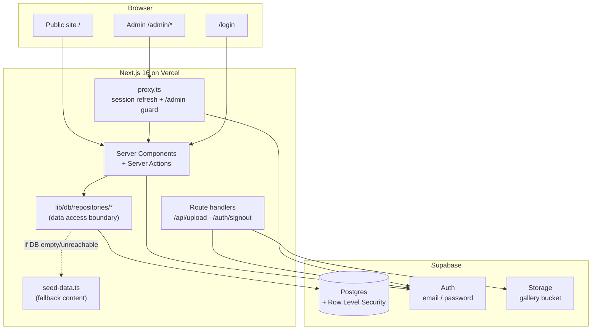
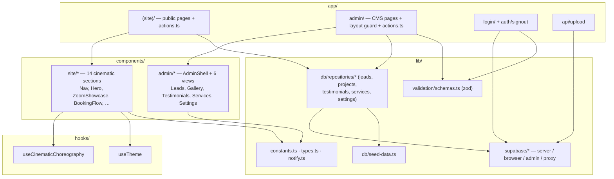
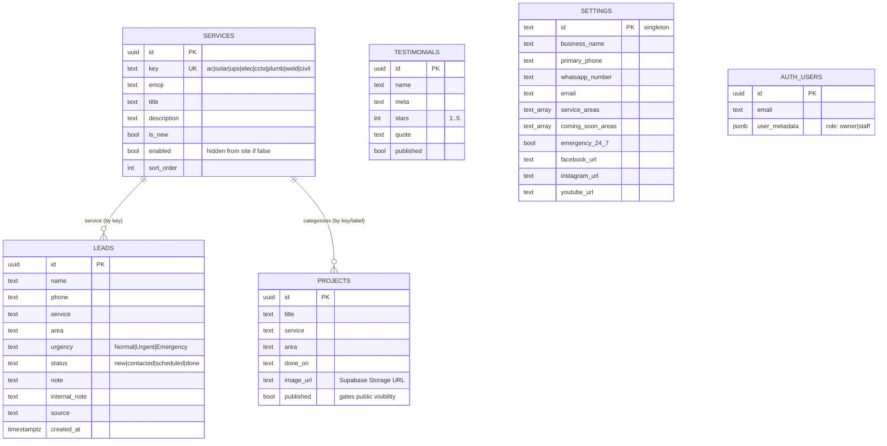
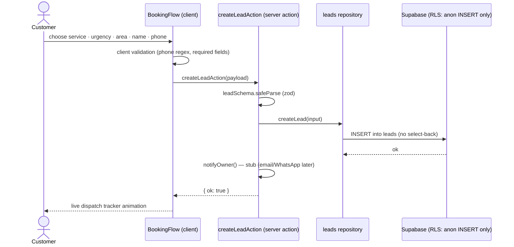
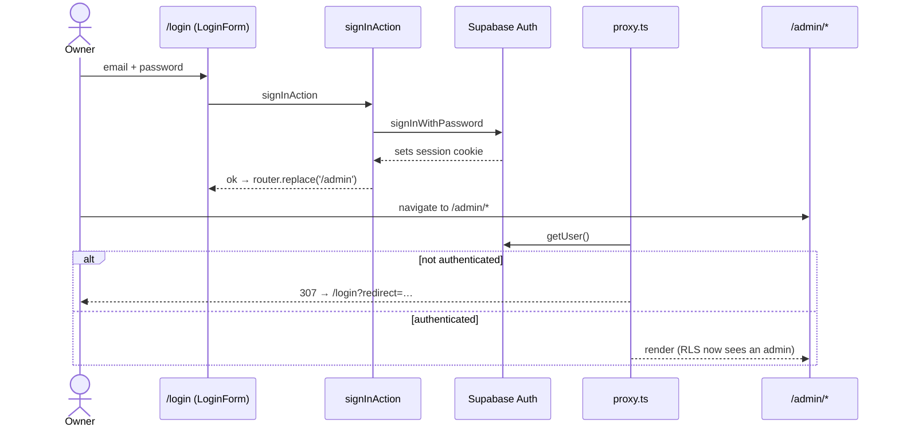
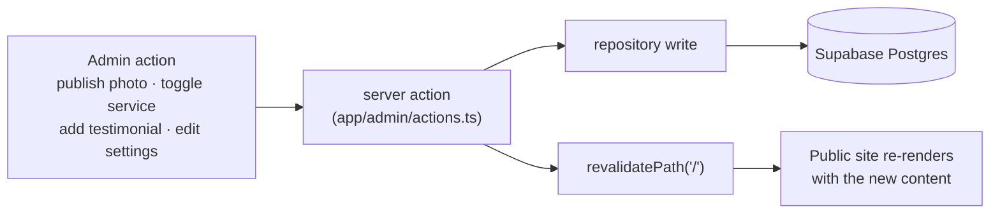
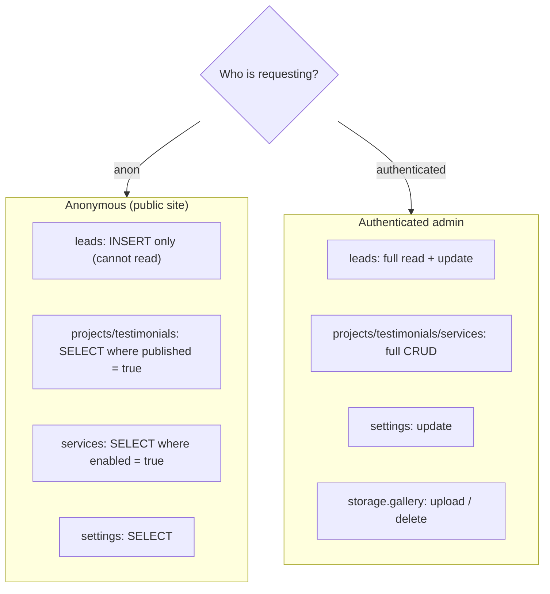
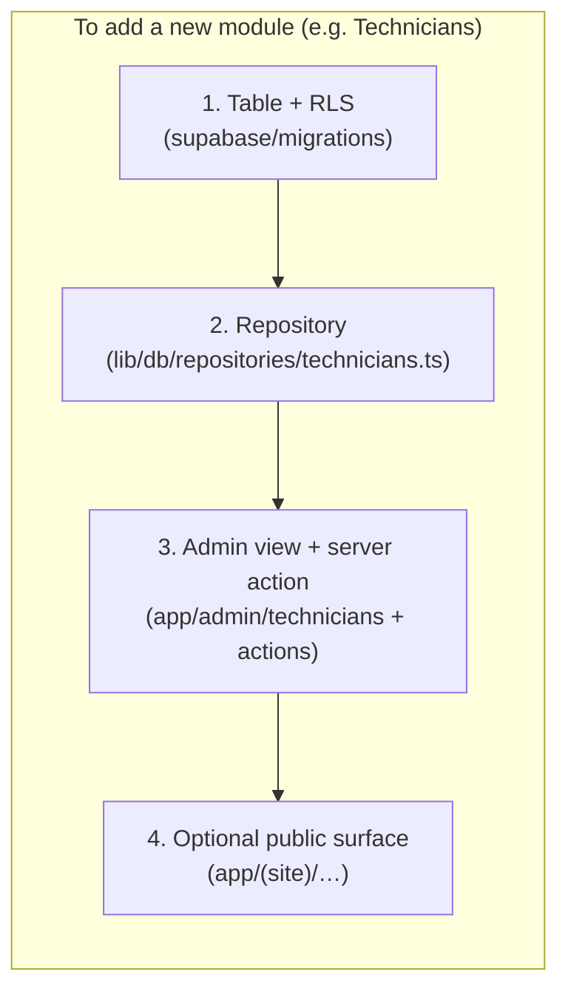

# Nexvolt Technical Services — Website + Admin CMS

A cinematic, scroll-animated marketing website with an **"order a fix like you order food"**
booking flow, a live dispatch tracker, and a **login-gated, no-code admin CMS** that lets the
business owner run the whole site — publish job photos, manage booking leads, edit testimonials,
toggle services, and update business details — with **zero developer involvement**.

Built for **Nexvolt Technical Services**, a Peshawar-based technical-services business
(AC, solar, inverter/UPS, electrical, CCTV, plumbing, welding, civil work).

> **Status:** v1 is feature-complete and runs against a live Supabase project. The architecture is
> deliberately layered so the product can grow into a multi-technician marketplace without a rewrite —
> see [Designed for expansion](#designed-for-expansion).

---

## Table of contents

- [What this is](#what-this-is)
- [Tech stack](#tech-stack)
- [System architecture](#system-architecture)
- [Module map](#module-map)
- [Data model](#data-model)
- [Key flows](#key-flows)
  - [Booking → real lead](#booking--real-lead)
  - [Auth + admin guard](#auth--admin-guard)
  - [Admin → live site](#admin--live-site)
- [Security model (RLS)](#security-model-rls)
- [Local setup](#local-setup)
- [Database & migrations](#database--migrations)
- [Admin accounts](#admin-accounts)
- [Scripts](#scripts)
- [Project structure](#project-structure)
- [Designed for expansion](#designed-for-expansion)
- [Roadmap](#roadmap)
- [Deployment](#deployment)

---

## What this is

Two surfaces, one codebase:

| Surface | Route | Who | Purpose |
|---|---|---|---|
| **Public site** | `/` | Everyone (indexable) | Cinematic landing page + booking flow + live tracker |
| **Login** | `/login` | Admins only | Supabase email/password sign-in — **no public signup** |
| **Admin CMS** | `/admin/*` | Authenticated admins | Overview, Leads, Gallery, Testimonials, Services, Settings |

The core promise: **anything the owner publishes in admin appears on the live site immediately** —
publish a photo, toggle a service off, approve a testimonial, change the phone number, and the public
site reflects it without touching code.

---

## Tech stack

| Concern | Choice |
|---|---|
| Framework | **Next.js 16** (App Router) + **TypeScript** |
| Styling | **Tailwind v4** + CSS variables (design tokens) |
| Animation | **Framer Motion** + CSS scroll choreography |
| Database / Auth / Storage | **Supabase** (Postgres + Auth + Storage) |
| Data access | **Repository layer** (`lib/db/repositories/*`) — the only place that talks to Supabase |
| Hosting | **Vercel** |
| Package manager | **pnpm** |
| Tests | **Vitest** (unit) |

---

## System architecture



**Why the repository boundary matters:** every read/write goes through `lib/db/repositories/*`.
Swapping or extending the backend (new tables, a different provider, caching) touches only that layer —
pages and actions never see raw Supabase queries.

---

## Module map



---

## Data model

Tables are intentionally **independent** (no hard foreign keys) — `service` values are linked by the
stable `services.key` string so the owner can rename/reorder freely. Admin identities live in
Supabase's managed `auth.users`.



---

## Key flows

### Booking → real lead



### Auth + admin guard



### Admin → live site



---

## Security model (RLS)

Authenticated == admin (there is no public signup). Row Level Security enforces it at the database,
not just the UI:



The service-role key is **only** used in server-only modules (seed script) and is never shipped to
the client. The booking insert deliberately does **not** read the row back (anon has no SELECT on leads).

---

## Local setup

```bash
pnpm install

# 1. Configure .env.local (see .env.example)
#    Required: NEXT_PUBLIC_SUPABASE_URL, NEXT_PUBLIC_SUPABASE_ANON_KEY
#    Optional: SUPABASE_SERVICE_ROLE_KEY (only for the `pnpm db:seed` path)

# 2. Apply schema + seed (already applied to the connected project)
pnpm db:push

# 3. Run
pnpm dev
```

If the database is empty or unreachable, the public site falls back to built-in seed content
(`lib/db/seed-data.ts`), so it always renders.

---

## Database & migrations

All schema, policies, the `gallery` storage bucket, and seed data live in `supabase/migrations/`:

| Migration | Contents |
|---|---|
| `0001_init.sql` | Tables + RLS policies + `gallery` storage bucket |
| `0002_seed_content.sql` | Services, settings, demo projects / testimonials / leads |
| `0003_admin_user.sql` | Owner login — created **only if** `app.admin_email` / `app.admin_password` settings are provided (no credential is committed) |

Apply with `pnpm db:push` (the `supabase` CLI is a dev dependency).

---

## Admin accounts

There is intentionally **no signup page**. Create admins one of three ways:

1. **Supabase Dashboard → Authentication → Add user** (simplest).
2. `pnpm db:seed` with the service-role key + `ADMIN_EMAIL` / `ADMIN_PASSWORD` in `.env.local`.
3. Apply `0003_admin_user.sql` while passing `app.admin_email` / `app.admin_password` Postgres settings.

The connected project was bootstrapped with an `owner@nexvolt.pk` account — **rotate its password**
in the Supabase dashboard. No credentials are stored in this repository.

---

## Scripts

| Script | Purpose |
|---|---|
| `pnpm dev` | Dev server |
| `pnpm build` / `pnpm start` | Production build / serve |
| `pnpm typecheck` | `tsc --noEmit` |
| `pnpm test` | Vitest unit tests |
| `pnpm db:push` | Apply Supabase migrations |
| `pnpm db:seed` | Seed via service-role admin API |

---

## Project structure

```
app/
  (site)/        public cinematic site — page.tsx assembles sections from the DB
  admin/         CMS: layout (auth guard) + 6 view pages + actions.ts (server actions)
  login/         Supabase Auth sign-in (+ actions.ts)
  auth/signout/  session clear route
  api/upload/    gallery photo upload → Supabase Storage
components/
  site/          14 cinematic sections + SiteShell
  admin/         AdminShell, Toast, StatusBadge + 5 view components
hooks/           useCinematicChoreography, useTheme
lib/
  db/repositories/   the only place that talks to Supabase (swappable)
  db/seed-data.ts    fallback content
  supabase/          server / browser / admin (service-role) / proxy clients
  validation/        zod schemas
  constants.ts types.ts notify.ts
supabase/          SQL migrations + seed script
proxy.ts           session refresh + /admin guard (Next 16 "proxy" convention)
```

---

## Designed for expansion

This is a v1 of a product meant to grow into a multi-technician platform. The structure already
supports that without a rewrite:

- **Repository boundary** — new domains (technicians, orders, payments) become new tables + a repo
  module + RLS policies; pages/actions consume the repo, never raw SQL.
- **New public pages** drop into `app/(site)/` (the footer already links to future `/services/[slug]`,
  `/projects`, `/about` as anchors).
- **New admin views** follow one pattern: a server page that loads via a repo + a client view that
  calls a server action in `app/admin/actions.ts`.
- **Roles** — `auth.users.user_metadata.role` (`owner` | `staff`) is already set; gate destructive
  actions or whole views by role when staff accounts are added.
- **Realtime + notifications** have explicit hook points: the tracker is timer-driven today but the
  `leads.status` column is built to be subscribed to via Supabase Realtime; `lib/notify.ts` is the
  single place to wire Resend / WhatsApp Cloud API.
- **Theming** is fully tokenized (CSS variables), so new surfaces inherit the design system.



---

## Roadmap

```mermaid
flowchart LR
  subgraph NOW["v1 — shipped"]
    N1["Book & track a fix"]
    N2["No-code Admin CMS"]
    N3["Leads · Gallery · Testimonials<br/>Services · Settings"]
  end
  subgraph NEXT["Next"]
    X1["Realtime tracker<br/>(Supabase Realtime on leads.status)"]
    X2["Owner notifications<br/>(Resend email / WhatsApp Cloud API)"]
    X3["Staff role + permissions"]
    X4["Public /services/[slug], /projects, /about"]
    X5["SEO: sitemap, OG images, analytics"]
  end
  subgraph LATER["Later"]
    L1["Verified technician network (marketplace)"]
    L2["Technician onboarding + ratings"]
    L3["Appliance & parts delivery + payments"]
    L4["Customer accounts + order history"]
  end
  NOW --> NEXT --> LATER
```



---

## Deployment

1. Push this repo to GitHub.
2. Import into **Vercel**, set the env vars from `.env.example` (use the Supabase **secret** key for
   `SUPABASE_SERVICE_ROLE_KEY` only if you use `pnpm db:seed`).
3. Point the custom domain (e.g. `alfarhantechnical.com` / your Nexvolt domain).
4. Gallery uploads go to Supabase Storage (Vercel's filesystem is ephemeral — already handled).

---

_Recreated from the Claude Design handoff. The HTML/CSS/JSX prototypes were the design spec; this is the
production port._
